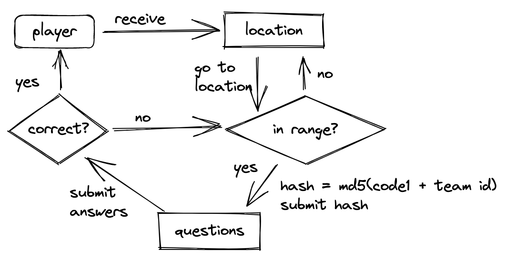
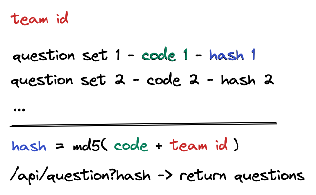
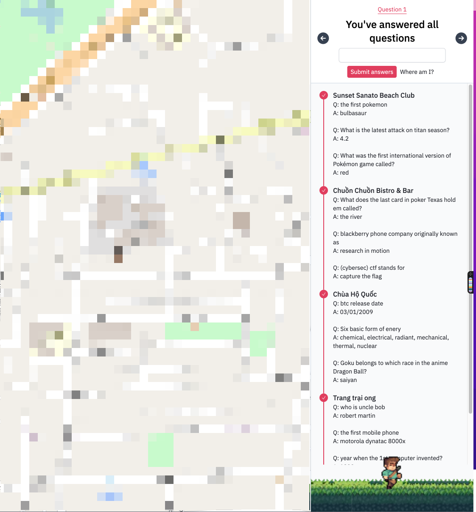
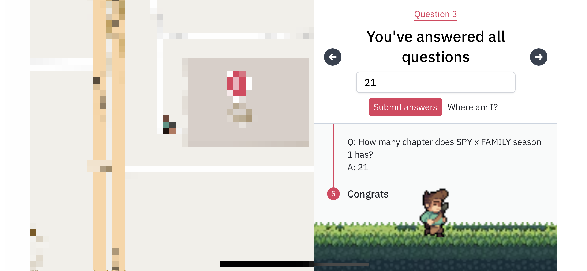

## :running: Run the project

First, run the development server:

```bash
npm run dev
# or
yarn dev
```

Open [http://localhost:3000](http://localhost:3000) with your browser to see the result.

## :rocket: Deployments

| URL                       | Note       |
| ------------------------- | ---------- |
| https://hunt.d.foundation | production |

## :robot: API

| Name                    | Value                                         | Documentation | Note       |
| ----------------------- | --------------------------------------------- | ------------- | ---------- |
| `df-treasure-hunt-2022` | [Link](https://df-treasure-hunt-2022.fly.dev) |               | Production |

## :books: Libraries

- ReactJS
- NextJS
- TailwindCSS
- Pluscodes
- Pigeon maps

## :arrows_clockwise: Flow



## :thinking: Challenge

One problem with this game was that players could easily inspect the network and get the next location without actually going to that location in real life. So we've come up with a way to hide that information in the request and introduce a new api to get questoins that requires a hash.

This hash is included in the minified js bundle code so it makes it harder for players to figure out the hash.



## :camera: Screenshots




## :sparkles: Assets

All images/assets used in this app is provided by [Jesse Munguia](https://jesse-m.itch.io/) which is an amazing artist

## :pray: Credits

A big thank to all who contributed to this project!

[](https://github.com/dwarvesf/treasure-hunt/graphs/contributors)
